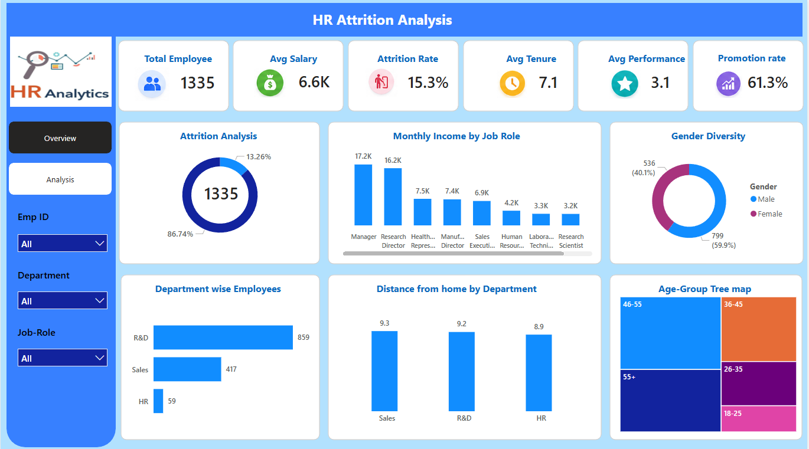
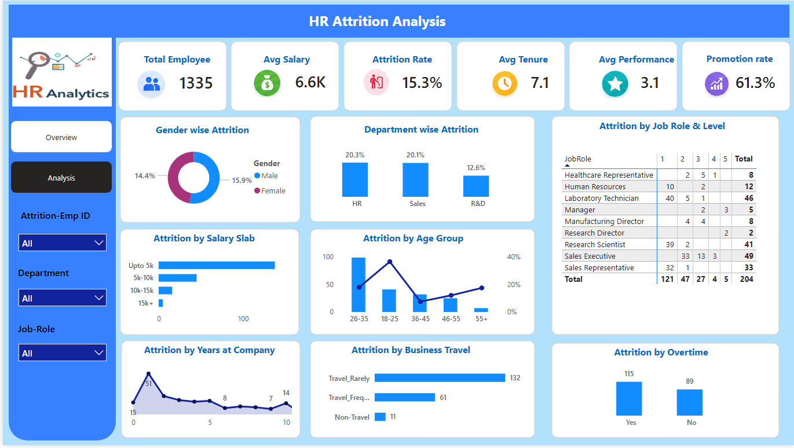

# HR Attrition Analysis

## Project Overview
Analyzed Employee attrition data to identify the facts affecting employee turnover.

## Tools Used
- MySQL
- Power BI

## Key Metrics
- Attrition rate
- Salary Analysis
- Job-Role wise Analysis
- Overtime Analysis
- Department wise Attrition

## Dashboard
 
 

## Insights

- The HR and Sales departments have the highest attrition rates.
- Male employees exhibit higher attrition rates than female employees.
- Employees with lower salaries are more likely to leave the company.
- Employees who work overtime have higher attrition rates.
- Employees aged 26–35 have the highest attrition rates.

## Author
Ayushi Goyal
